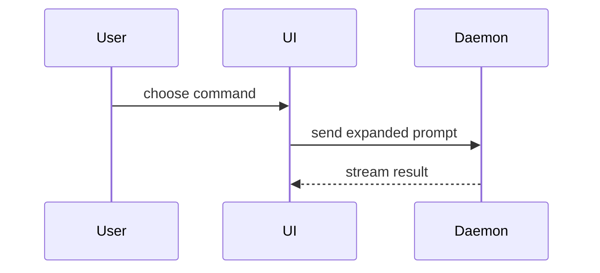

使用此範本撰寫 PR 內文：

```markdown
## 摘要

<圖表、diff 草圖或樹狀圖>

## 實證

- **修改前：** <螢幕截圖／輸出／失敗的測試執行>
  **修改後：** <螢幕截圖／輸出／通過的測試執行>

## 合併風險

**門：** <單向門或雙向門>

<選填：說明>

**影響半徑：** <單字說明>

<選填：合併的潛在影響>
```

## 各個區段

略過所有開場白並保持文字簡潔。使用來自 `GLOSSARY.md` 的使用者領域語言。

### 摘要

挑選能清楚說明關鍵重點的最小檢視表。

- 將邏輯或演算法呈現為虛擬碼：

```text
on(save)
  if content is unchanged
    return cached result
  write new content
  return fresh result
```

- 將執行時期控制流程呈現為呼叫樹：

```text
submitForm
  createSession
    persistPrompt
    launchAgent
  navigateToSession
```

- 將 UI 結構呈現為元件樹，包括重要的狀態與模組邊界：

```text
<SessionPage> (apps/example/src/routes/session.tsx)
  useSessionEvents()
  <SessionToolbar>
    <RunSkillButton> (packages/ui)
```

- 將檔案職責或廣泛重構呈現為淺層檔案樹：

```text
src/
├── commands/       # parses user actions
├── sessions/       # owns session state
└── transport/      # sends API requests
```

- 使用 Mermaid 呈現元件互動、控制流程或資料流程：



- 當重點在於「變更了什麼」且周圍架構已存在時，使用 `diff`。讓 diff 結構切合主題。

元件變更範例：

```diff
 <SessionPage>
   useSessionEvents()
   <SessionToolbar>
+    <RunSkillButton />
   <SessionTimeline>
+    <SkillResultCard />
```

檔案配置變更範例：

```diff
 src/
 ├── commands/
+│   └── show-me.ts       # expands the slash command
 ├── sessions/
-└── transport.ts
+└── transport/
+    ├── client.ts
+    └── stream.ts
```

呼叫樹或呼叫堆疊變更範例：

```diff
 submitForm
   createSession
     persistPrompt
+    expandSkillMention
     launchAgent
-  navigateToSession
+  navigateToSession
+    subscribeToEvents
```

狀態或控制流程變更範例：

```diff
 on(save)
-  write content
+  if content is unchanged
+    return cached result
+  write new content
+  invalidate cache
```

- 當大部分內容為新增、省略上下文會隱藏所有權或順序，或使用者需要可複製的目標結構時，顯示整個區塊：

```ts
function expandSkill(command: string): string {
  const skillName = command.slice(1);
  return `use the ${skillName} skill`;
}
```

#### 指引

將每個視覺效果放置在它所支援的簡短文字旁。僅保留回答使用者目前問題或解決目前討論點之選項所需的呼叫、檔案、props、狀態與邊界。

您可以使用其中一種，也可以使用幾種，但不太可能使用全部。請運用您的判斷力，不要讓使用者負擔過重。

### 實證

具體證明變更有效。顯示修改前與修改後。

螢幕截圖屬於 S-tier——在環境支援且變更屬於視覺性質時。

基於執行的實證屬於 A-tier。測試結果、主控台輸出。使用虛擬碼顯示現在失敗與通過的確切測試。

### 合併風險

描述它是單向門還是雙向門。您可以從雙向門走回，但無法從單向門走回。容易復原的 PR 風險較低。涉及破壞性操作或難以逆轉決策的變更屬於單向門。

影響半徑是指此 PR 所引入變更的潛在影響或範圍。考量所有可能性。範例包括排版位移、對使用者的中斷損壞、行動裝置回應性等。
